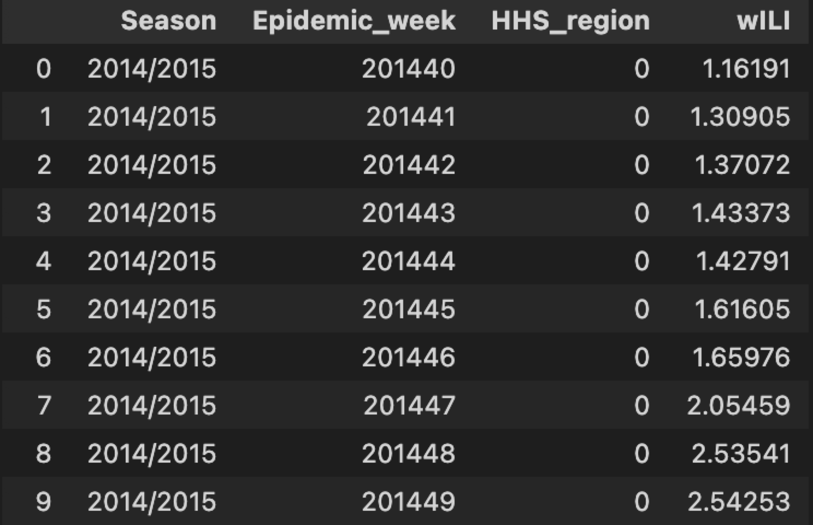
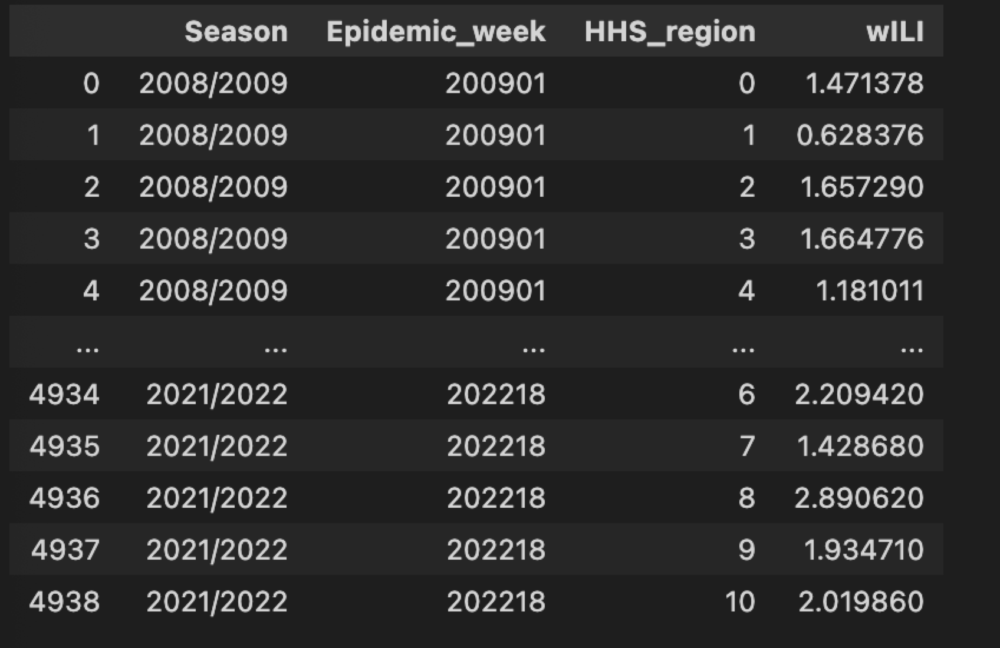
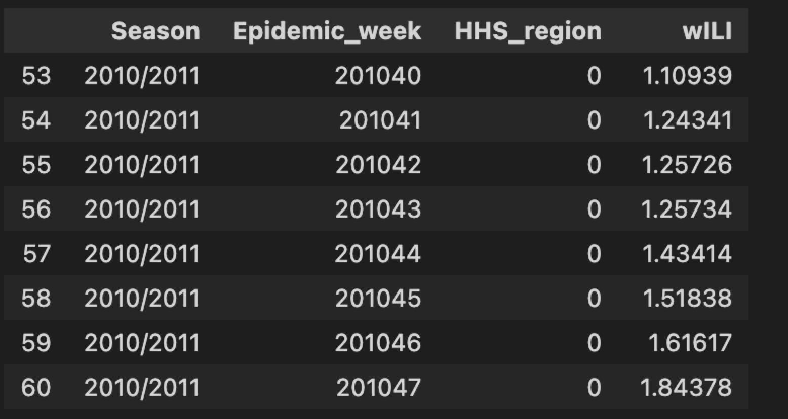
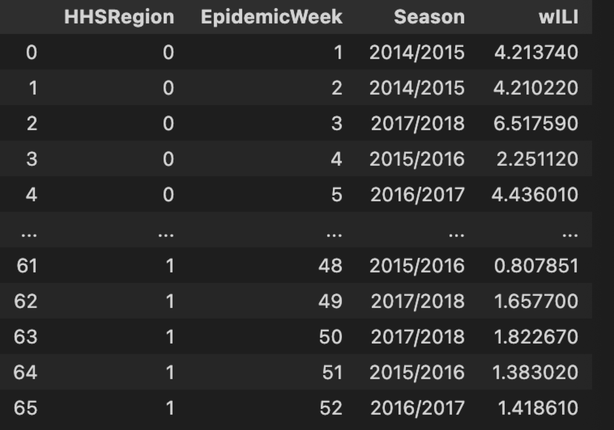

Usage
=====

Installation
------------

To use chimeric_tools, first install it using pip:

.. code-block:: console

   $ pip install chimeric_tools

Prepocess 
--------------------------------

.. automodule:: chimeric_tools.Prepocess
   :members:
   :undoc-members:
   :show-inheritance:

Spatial 
------------------------------

.. .. automodule:: chimeric_tools.Spatial
..    :members:
..    :undoc-members:
..    :show-inheritance:
.. autofunction:: chimeric_tools.Spatial.GetStateAbbreviation(String)

>>> from chimeric_tools import Spatial
>>> Spatial.GetStateAbbreviation("Pennsylvania")
"PA"

.. autofunction:: chimeric_tools.Spatial.fromState2FIPS(String)

>>> from chimeric_tools import Spatial
>>> Spatial.fromState2FIPS("PA")
42

Time 
---------------------------
Contains some fuctions that can be used to show the epiweeks info.

.. .. automodule:: chimeric_tools.Time
..    :members:
..    :undoc-members:
..    :show-inheritance:

.. autofunction:: chimeric_tools.Time.todayEpiWeek

>>> from chimeric_tools import Time
>>> Time.todayEpiWeek()
12

.. autofunction:: chimeric_tools.Time.fromDate2Epiweek(String)

>>> from chimeric_tools import Time
>>> Time.fromDate2Epiweek(fromDate2Epiweek("2020-03-22"))
13

.. autofunction:: chimeric_tools.Time.fromDates2Epiweeks(List)

>>> from chimeric_tools import Time
>>> Time.fromDates2Epiweeks(["2020-01-22","2020-02-23","2020-03-24"])
[4, 9, 13]

Data 
---------------------------
Contains some fuctions to crawl data from the Epidata and generate dataframes.

.. autofunction:: chimeric_tools.Data.crawl_data_to_feature_specific(startepiweek, endepiweek, regions)

>>> from chimeric_tools import Data
>>> Data.crawl_data_to_feature_specific(201440, 201510, ['nat'])

.. autofunction:: chimeric_tools.Data.crawl_data_to_feature_all(startepiweek, endepiweek)

>>> from chimeric_tools import Data
>>> Data.crawl_data_to_feature_all(200901, 202218)

.. autofunction:: chimeric_tools.Data.randomly_select_fluseason(probobilility_dic,season_features_path)

>>> from chimeric_tools import Data
>>> Data.randomly_select_fluseason({"2010/2011":0.9,"2011/2012":0.1},season_features_path)

.. autofunction:: chimeric_tools.Data.random_generate_fluseason(startyear,endyear,features,regions=None)

>>> from chimeric_tools import Data
>>> Data.random_generate_fluseason(startyear,endyear,features,regions=None)

.. Module contents
.. ---------------

.. .. automodule:: chimeric_tools
..    :members:
..    :undoc-members:
..    :show-inheritance:
